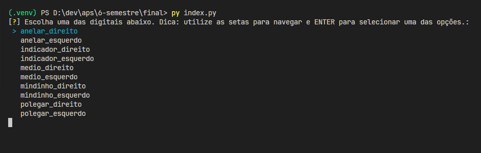
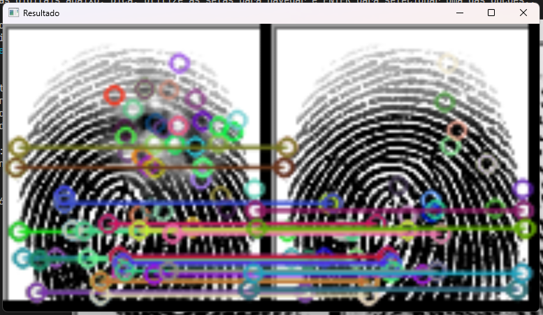

# APS 6sem - Biometria utilizando algoritmo SIFT

## Utilização

Para executar este projeto, basta seguir os comandos e passos abaixo:

Primeiro faça o clone do projeto:
```bash
    git clone url
    cd nome_pasta
```
Dentro da pasta e com Python 3.12 instalado, execute o seguinte comando para criar um ambiente virtual:
```python
    python -m venv venv
```

Após a criação do `venv`, é necessário inicializar o ambiente virtual. Para isso, execute os comandos abaixo:

Caso esteja no Linux:
```bash
    source ./venv/bin/activate
```

Caso esteja no Windows:
```bash
    ./venv/Scripts/activate
```

Uma vez inicializado o `venv`, o próximo passo é instalar as dependências do projeto. Para isso, execute o seguinte comando:
```python
    pip install -r requirements.txt
```

Após finalizado o processo de instalação de dependências, podemos executar o projeto normalmente:
```python
    py index.py
```

## Projeto em execução

### Início de execução


### Execução em progresso


### Resultado da execução

